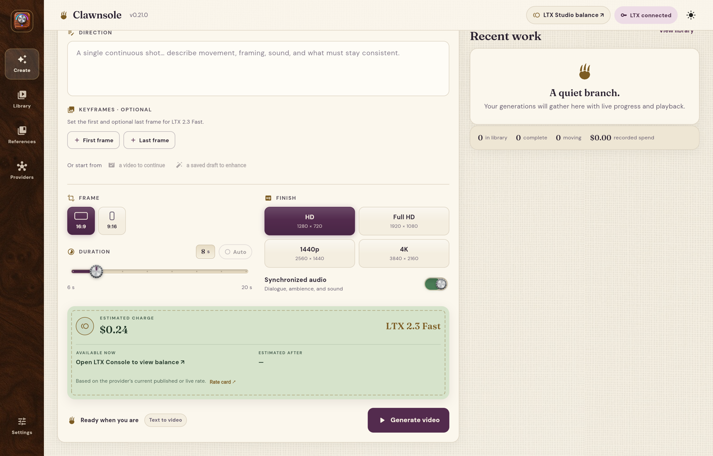

<p align="center">
  
</p>

<h1 align="center">Clawnsole</h1>

<p align="center"><em>Local BYO key studio for AI video generation</em></p>

<p align="center">
  <a href="https://github.com/heresalexandria/clawnsole/releases/latest/download/Clawnsole-mac-arm64.dmg"><strong>Download the latest macOS build (Apple silicon)</strong></a>
</p>

<p align="center">
  
</p>

Clawnsole is a local-first Flutter video generation workspace with a premium,
midcentury-inspired interface. It currently supports Black Forest Labs' FLUX 3
video API and keeps provider boundaries explicit for future video services.

## What it does

- Text-to-video, image-to-video, video continuation, and draft enhancement
- One to ten start, end, and intermediate keyframes with even or exact timing
- All documented durations, aspect ratios, resolutions, audio, draft, and safety controls
- Live polling, progress, provider credit balance, and setting-aware estimates
- Exact per-generation credit and USD history
- Reload-safe input previews, completed-video playback, download, and full input reuse
- Uncapped compact history with retained media files and granular clear controls
- Local API-key setup with no database, `localStorage`, or IndexedDB history

## One product, four targets

Flutter owns all product behavior. Electron is only the macOS lifecycle and
self-update shell around Flutter's web build and local Dart companion. The old
root Next.js implementation has been removed.

```bash
# from the repository root
./flutter/scripts/start_web
./flutter/scripts/start_ios
./flutter/scripts/start_android
./flutter/scripts/start_macos
```

The matching deployable builds are:

```bash
./flutter/scripts/build_web
./flutter/scripts/build_ios
./flutter/scripts/build_android
./flutter/scripts/build_macos
```

See [Flutter setup](flutter/README.md) and [macOS desktop packaging](electron/README.md).

## Persistence

Clawnsole has no database and uses no browser storage for history. Native apps
store `clawnsole.json` inside their application support sandbox. Companion-backed
web and Electron store the same compact schema in a local file, with retained
inputs and videos in an adjacent `assets/` directory.

- History is not capped.
- Base64 request payloads and video blobs are never stored in JSON.
- Removing history prunes media no longer referenced by another generation.
- BFL delivery links are temporary; completed videos are retained locally first.
- The BFL key is plaintext inside the locally protected JSON file and is never
  returned to the web renderer.

## Architecture

- `flutter/lib/core/`: provider contracts, pricing, models, gateways, and storage
- `flutter/lib/app/`: application state and composition
- `flutter/lib/ui/`: shared responsive screens and widgets
- `flutter/tool/clawnsole_companion.dart`: loopback web/API/media companion
- `electron/`: macOS shell, packaging, checksum-verified GitHub updater
- `.github/workflows/`: PR checks and parallel iOS/macOS releases

## Releases and desktop updates

Merging a PR with exactly one of `major`, `minor`, `patch`, or `no-release`
drives the release workflow. iOS and macOS build in parallel, then a GitHub
release is published with checksums. A manual workflow dispatch can cut the
first release or a release without a PR. The iOS job also uploads its signed IPA
to App Store Connect; Apple review and public release remain explicit approvals.

Packaged Electron builds check GitHub at most once per day and expose
**Clawnsole → Check for Updates…**. An accepted update downloads the architecture
matched ZIP, verifies `SHA256SUMS.txt`, replaces the installed app with rollback,
and reopens it. iOS remains under normal App Store distribution semantics.

See [release setup](docs/releases.md) and [desktop updates](docs/updates.md).

## Verification

```bash
cd flutter
dart format --output=none --set-exit-if-changed lib tool test
flutter analyze
flutter test
flutter build web

cd ../electron
npm test
```

The implementation follows BFL's official [FLUX 3 video documentation](https://docs.bfl.ai/flux_3/flux3_video), [API reference](https://docs.bfl.ai/api-reference/utility/generate-a-video-with-flux-3), [pricing calculator](https://bfl.ai/pricing), and [polling guidance](https://docs.bfl.ai/api_integration/integration_guidelines).
