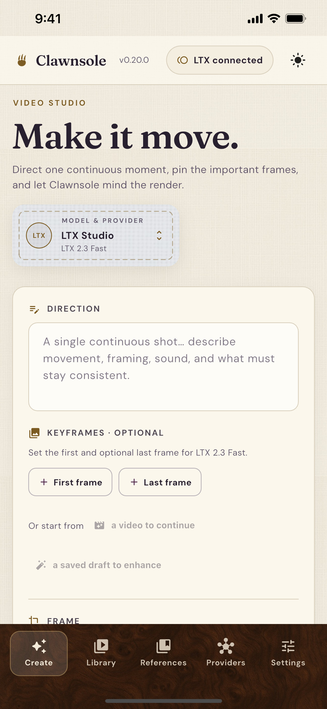
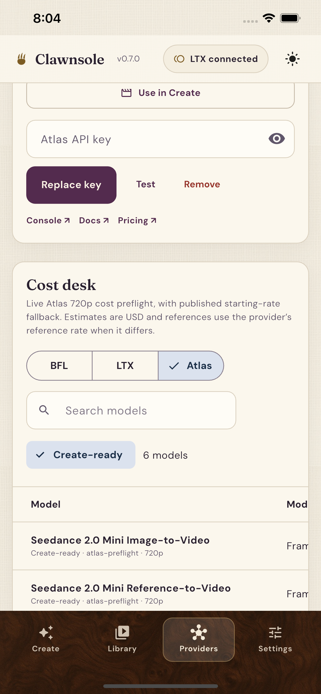
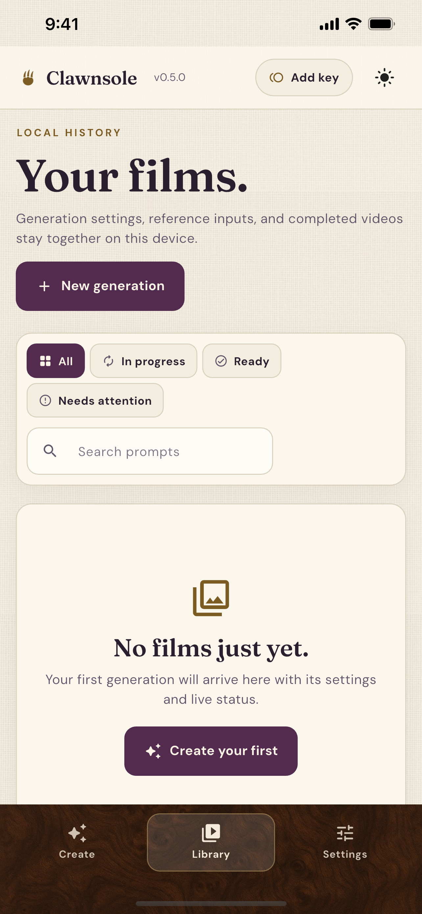

<p align="center">
  
</p>

<h1 align="center">Clawnsole</h1>

<p align="center"><em>Local BYO key studio for AI video generation</em></p>

<p align="center">
  <a href="https://github.com/heresalexandria/clawnsole/releases/latest/download/Clawnsole-mac-arm64.dmg"><strong>Download the latest macOS build (Apple silicon)</strong></a>
</p>

<p align="center">
  <picture>
    <source media="(prefers-color-scheme: dark)" srcset="docs/assets/clawnsole-preview-dark.png">
    
  </picture>
</p>

Clawnsole is a local-first Flutter video generation workspace with a premium,
midcentury-inspired interface. Cloud video providers share one provider-neutral
Create and Library workflow. The local Library can be shaped into project
folders and reusable tags without uploading its catalog anywhere.

## iPhone

<p align="center">
  
  
  
</p>

## What it does

- Provider-aware text-to-video and image-to-video, plus FLUX 3 continuation and draft enhancement
- Up to 30 reference frames, with timing and placement controls where the selected model supports them
- Model-specific durations, aspect ratios, resolutions, audio, draft, and safety controls
- Live polling, manual status refresh, surfaced provider errors, and progress
- Provider balance when exposed by the API, plus setting-aware USD or credit estimates
- Per-generation quoted and realized USD cost history with provenance
- Reload-safe input previews, fullscreen playback, save-as download, and full input reuse
- Nested project folders, multi-tag organization, and combined prompt/tag/folder search
- One-tap folder and tag filters with a desktop folder rail and compact mobile picker
- System-aware light and dark themes with an explicit appearance switcher
- Uncapped compact history with retained media files and granular clear controls
- Local API-key setup with no database, `localStorage`, or IndexedDB history
- A Providers desk for per-provider keys, console/docs links, live Atlas model
  discovery, canonical cross-provider model matching, observed quote variance,
  and route-aware 10/15/20/30-second USD comparisons

## One product, four targets

Flutter owns all product behavior. Electron is only the macOS lifecycle and
self-update shell around Flutter's web build and local Dart companion. The old
root Next.js implementation has been removed.

```bash
# from the repository root
./flutter/scripts/start_web
./flutter/scripts/start_ios
./flutter/scripts/start_android
./flutter/scripts/start_macos
```

The matching deployable builds are:

```bash
./flutter/scripts/build_web
./flutter/scripts/build_ios
./flutter/scripts/build_android
./flutter/scripts/build_macos
```

See [Flutter setup](flutter/README.md) and [macOS desktop packaging](electron/README.md).

## Persistence

Clawnsole has no database and uses no browser storage for history. Native apps
store `clawnsole.json` inside their application support sandbox. Companion-backed
web and Electron store the same compact schema in a local file, with retained
inputs and videos in an adjacent `assets/` directory.

- History is not capped.
- Folder names, tag labels, and generation assignments live in the same compact
  local JSON schema and migrate without changing older records.
- Removing a folder never removes its films; directly filed work returns to
  **Unfiled**, tags stay intact, and subfolders move up one level.
- Base64 request payloads and video blobs are never stored in JSON.
- Removing history prunes media no longer referenced by another generation.
- Provider delivery links may be temporary; completed videos are retained locally first.
- User-supplied provider keys are plaintext inside the locally protected JSON file
  and are never returned to the web renderer. An optional temporary iOS App
  Review fallback is compiled only by the local iOS build script, never written
  to local JSON, and never displayed in the app.

## Architecture

- `flutter/lib/core/`: provider contracts, pricing, models, gateways, and storage
- `flutter/lib/app/`: application state and composition
- `flutter/lib/ui/`: shared responsive screens and widgets
- `flutter/tool/clawnsole_companion.dart`: loopback web/API/media companion
- `electron/`: macOS shell, packaging, checksum-verified GitHub updater
- `.github/workflows/`: PR checks and signed macOS releases

## Releases and desktop updates

Merging a PR with exactly one of `major`, `minor`, `patch`, or `no-release`
drives the signed and notarized macOS release workflow. A manual dispatch can
cut a release without a PR or retry the current synchronized version after a
recoverable failure. iOS builds are intentionally local-only through
`./flutter/scripts/build_ios`; GitHub never receives the iOS signing material or
an IPA.

Packaged Electron builds check GitHub at most once per day and expose
**Clawnsole → Check for Updates…**. An accepted update downloads the architecture
matched ZIP, verifies `SHA256SUMS.txt`, replaces the installed app with rollback,
and reopens it. iOS remains under normal App Store distribution semantics.

See [release setup](docs/releases.md) and [desktop updates](docs/updates.md).

## Privacy and support

Read the [privacy policy](PRIVACY.md), its
[public web version](https://heresalexandria.github.io/clawnsole/privacy/), or use the
[issue tracker](https://github.com/heresalexandria/clawnsole/issues) for support.
Do not post API keys, private prompts, or personal media in a public issue.

## Verification

```bash
cd flutter
dart format --output=none --set-exit-if-changed lib tool test
flutter analyze
flutter test
flutter build web

cd ../electron
npm test
```

Provider contracts and fallback rates follow the official
[BFL documentation](https://docs.bfl.ai/flux_3/flux3_video),
[LTX documentation](https://docs.ltx.io), and
[Atlas Cloud video documentation](https://www.atlascloud.ai/docs/models/video).
Atlas models are refreshed from its public catalog and Create-ready costs use
schema-aware, no-charge request preflight when available. Equivalent model
routes retain provider-specific IDs while sharing a canonical comparison ID.
